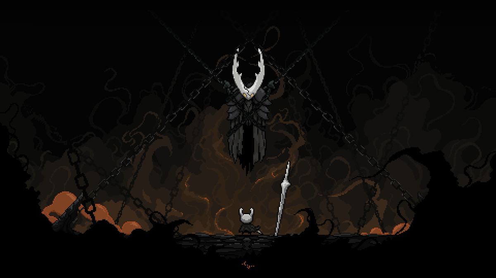

<!-- ============================================================
     HALLOWNEST // champion19007
     Palette: void #0A0A0A · bone #F0EDE5 · infection #E0752D
              ghost #8FB8C9 · soul #9FD8E8 · pale gold #E8C87A
     Pixel headings: readme-typing-svg + Press Start 2P
     ============================================================ -->

 

---

<!-- ================= THE VESSEL ================= -->

<table>
<tr>
<td width="68%" valign="top">
 
My work sits at the intersection of <b>LLMs</b>, <b>Computer Vision</b>, and <b>Reinforcement Learning</b> — I design agents that reason, plan, see, and act with autonomy.
  
I have worked across the stack: transformer models and RAG pipelines, ROS2 robotics systems, CV model training, and hybrid RL + search algorithms. I care about engineering that is clean, scalable, and grounded in real research.
  
<b>Currently exploring —</b> how search, reinforcement learning, and transformers combine into something greater than their parts.
  

</td>
<td width="32%" align="center" valign="middle">

 
<i>resting at the bench</i>
</td>
</tr>
</table>

---

<!-- ================= RELICS ================= -->

 
<i>sealed vessels — the work worth opening first</i>

 

<table>
<tr>
<td width="50%" valign="top">
<h3>♟️ <a href="https://github.com/champion19007/Chess_engine_with_Deep_Reinforcement_learning-minmax-mcts-Cpp">Hybrid Minimax–MCTS Chess Engine</a></h3>
A patent-inspired hybrid engine fusing <b>Minimax</b>, <b>MCTS</b>, and deep evaluation networks in C++.
  

</td>
<td width="50%" valign="top">
<h3>🤖 <a href="https://github.com/champion19007/RL-Chess-Engine-Minimax-MCTS">RL Chess Engine — Deep RL + Search</a></h3>
Reinforcement learning chess engine pairing <b>policy/value networks</b> with Monte Carlo Tree Search.
  

</td>
</tr>
<tr>
<td width="50%" valign="top">
<h3>🐾 <a href="https://github.com/champion19007/Real-Time-Animal-Detection-Using-CCTV-Camera-OpenVision">Real-Time Animal Detection (CCTV)</a></h3>
YOLO + OpenCV pipeline detecting animals live from CCTV streams — built for safety monitoring and rapid alerting.
  

</td>
<td width="50%" valign="top">
<h3>📈 <a href="https://github.com/champion19007/Advanced-Stock-Forecaster-CNN-BiLSTM-GRU-">Advanced Stock Forecaster</a></h3>
Hybrid <b>CNN + BiLSTM + GRU</b> model for time-series forecasting, capturing local patterns and long-range dependencies.
  

</td>
</tr>
<!-- TODO(human): add a third row here with two more project cards.
     Copy the shape of the <tr> above: <h3> with emoji + linked repo name,
     one line of description,   , then 2-3 flat-square badges on 0A0A0A.
     Keep descriptions to one line so the side-by-side cards stay even. -->
</table>

---

<!-- ================= CHARMS ================= -->

**⟡ Languages**

       

**⟡ Frameworks**

          

**⟡ Tools & Platforms**

         

---

<!-- ================= NAIL ARTS ================= -->

<table>
<tr>
<td width="50%" valign="top">
<h3>⚔️ What I Build</h3>
<ul>
<li><b>LLM Agent Systems</b> — planning, tool use, memory</li>
<li><b>RAG &amp; Retrieval Pipelines</b> — vector search, rerankers</li>
<li><b>Computer Vision Models</b> — CNNs, ViTs, YOLO</li>
<li><b>Reinforcement Learning + Search</b> — MCTS, Minimax</li>
<li><b>Backend Architectures</b> — FastAPI, PostgreSQL, Docker</li>
<li><b>Hybrid Research Engines</b> — Search + RL + Transformers</li>
</ul>
</td>
<td width="50%" valign="top">
<h3>✨ What I Can Help With</h3>
<ul>
<li><b>Agent design</b> — knowledge graphs, tool routing, memory</li>
<li><b>Vision systems</b> — detection, segmentation, transformers</li>
<li><b>Reward engineering</b> — game-AI, hybrid MCTS models</li>
<li><b>Model serving</b> — scalable inference backends</li>
<li><b>PyTorch optimization</b> — speed, memory, ONNX export</li>
<li><b>MLOps</b> — tracking, CI/CD, reproducible pipelines</li>
</ul>
</td>
</tr>
</table>

---

<!-- ================= HUNTERS JOURNAL ================= -->

 

  

<b>⟡ RELICS OF THE HUNT ⟡</b>

  

<b>⟡ TRAILS WALKED ⟡</b>

<!-- ------------------------------------------------------------------
     NOTE: github-readme-stats and github-profile-trophy cards were
     removed on purpose -- their public instances are permanently down
     (503 and 402 respectively, for every user, not just this profile).
     To bring the stats card back, deploy your own instance:
       https://github.com/anuraghazra/github-readme-stats#deploy-on-your-own
     then re-add, swapping in YOUR-INSTANCE.vercel.app:

     
     
     ------------------------------------------------------------------ -->

<b>◆ Full metrics — click to expand</b>

 

---

<!-- ================= THE ARCHIVES ================= -->

 
<i>notes → documentation → experiments → deployment</i>

 

<b>◆ My research &amp; documentation workflow</b>

 
<table>
<tr>
<td width="50%" valign="top">
<h4>📚 Notes &amp; Knowledge Base</h4>
<ul>
<li><a href="https://obsidian.md">Obsidian</a> — main AI/ML knowledge vault</li>
<li><a href="https://www.notion.so">Notion</a> — structured docs + planning</li>
<li><a href="https://excalidraw.com">Excalidraw</a> — ML architecture sketches</li>
<li><a href="https://app.diagrams.net">Draw.io</a> — system &amp; pipeline diagrams</li>
</ul>
<h4>🎥 Learning Channels</h4>
<ul>
<li><a href="https://www.youtube.com/@AndrejKarpathy">Andrej Karpathy</a> — transformers, LLM systems</li>
<li><a href="https://www.youtube.com/@YannicKilcher">Yannic Kilcher</a> — paper deep dives</li>
<li><a href="https://www.youtube.com/@TwoMinutePapers">Two Minute Papers</a> — research summaries</li>
<li><a href="https://www.youtube.com/@deepmind">DeepMind</a> — research talks</li>
</ul>
</td>
<td width="50%" valign="top">
<h4>📄 Reference Documentation</h4>
<ul>
<li><a href="https://pytorch.org/docs">PyTorch</a> · <a href="https://huggingface.co/docs/transformers">Transformers</a></li>
<li><a href="https://python.langchain.com/docs">LangChain</a> · <a href="https://docs.ultralytics.com">Ultralytics YOLO</a></li>
<li><a href="https://gymnasium.farama.org">Gymnasium</a> · <a href="https://stable-baselines3.readthedocs.io">Stable Baselines3</a></li>
</ul>
<h4>🧪 Experimentation &amp; Tracking</h4>
<ul>
<li><a href="https://wandb.ai">Weights &amp; Biases</a> — experiment tracking</li>
<li><a href="https://www.tensorflow.org/tensorboard">TensorBoard</a> — training visualization</li>
<li><a href="https://jupyter.org">Jupyter</a> — exploration notebooks</li>
</ul>
<h4>🔧 Useful Tools</h4>
<ul>
<li><a href="https://paperswithcode.com">Papers With Code</a> · <a href="https://arxiv.org">arXiv</a></li>
<li><a href="https://ollama.com">Ollama</a> · <a href="https://lmstudio.ai">LM Studio</a></li>
</ul>
</td>
</tr>
</table>

---

 

⬦ Hallownest awaits ⬦

